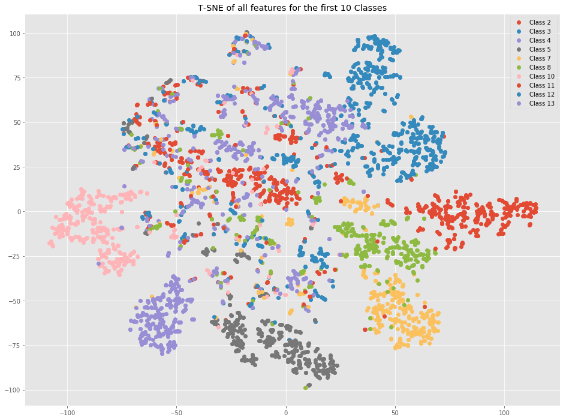

# Biometric Prediction on Keystroke Dynamics

This project takes a look at a biometric classifier with keystroke dynamics. Besides typing a password to validate a user, it is possible to discriminate users by their typing rhythms. This features can be used to detect impostors. This project is based on the data set of the publication _Killourhy, K. S., & Maxion, R. A. [Comparing anomaly detectors for keystroke dynamics.](http://www.cs.cmu.edu/%7Emaxion/pubs/KillourhyMaxion09.pdf) In Proc. of the Int. Conf. on Dependable Systems and Networks (DSN) (pp. 125-134)_. The objective is to build a classification baser on neural networks with the [keras](https://keras.io/) library.

The [data set](https://www.cs.cmu.edu/~keystroke/) consists of 51 subject each typing the password `.tie5Roanl` 400 times. The measures collected are the hold time (H), keydown-keydown time (DD) and keyup-keydown time (UD).

# License 
This project is licensed under the MIT license. See the [LICENSE](LICENSE) for details
